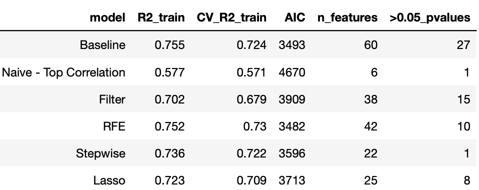
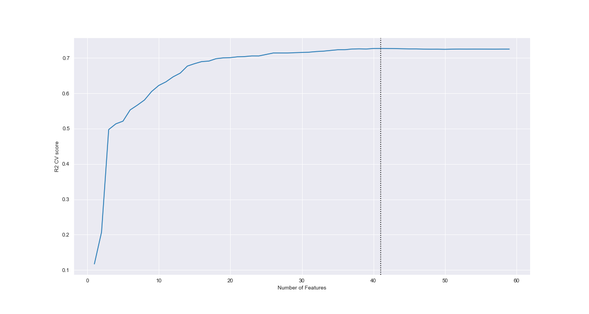
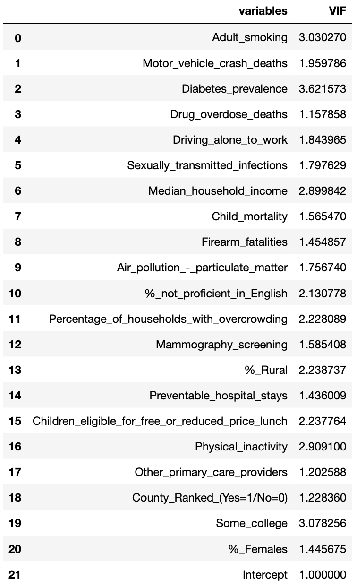
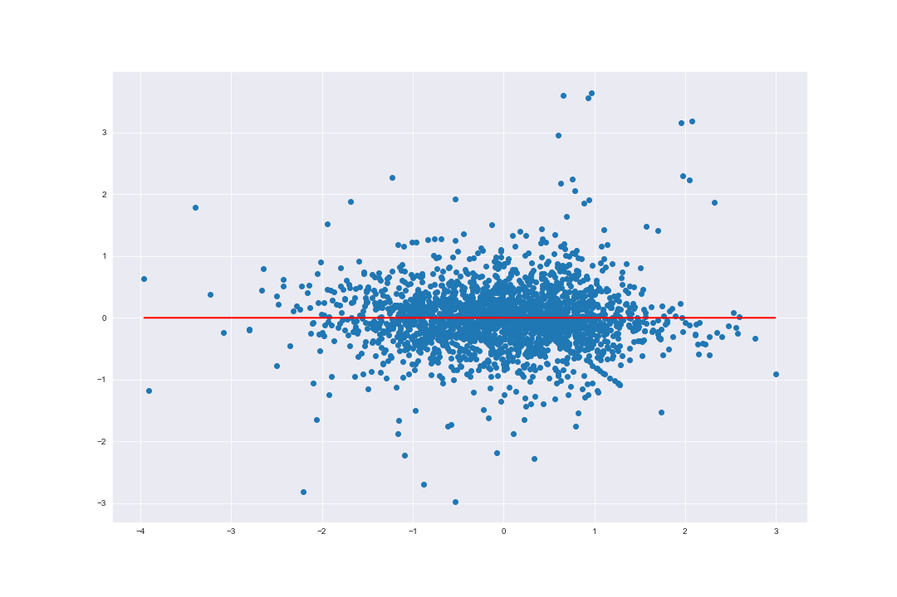
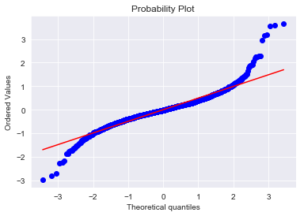
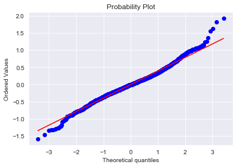
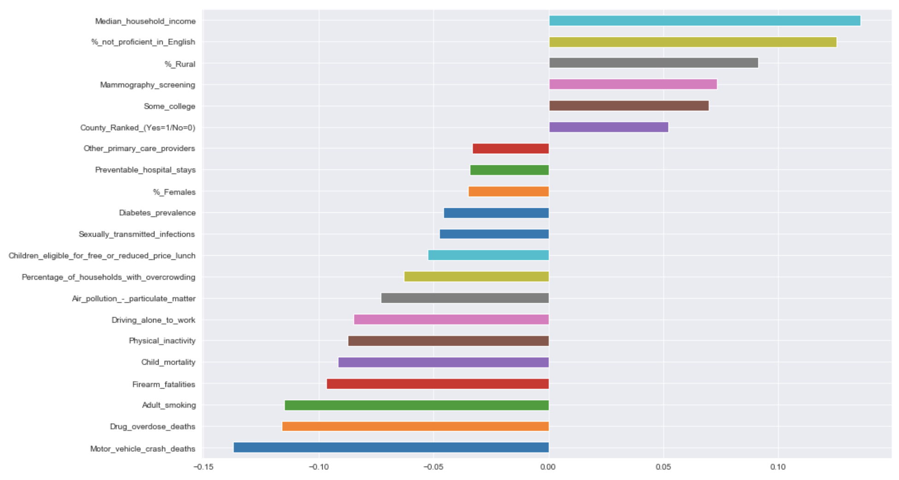
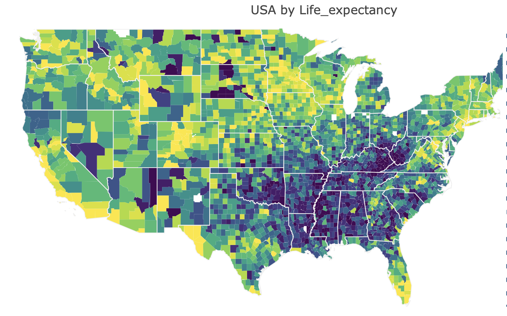

# Regression_Insurance_Analysis
Authors: Finn Tan and Sara Zylfo

We are a healthcare consultancy company hired by an European Life Insurance firm who is looking to expand into the US market. As such, we have been tasked to provide some statisical insights into the main drivers of life expectancy which will be a crucial input in driving our client's pricing strategies.

Coupled with the above, we were also required to suggest 5 US states that would be best to break into, which were ultimately conducted by finding a subset of US states with high life expectancy but with low life insurance coverage. 

In order to accomplish this, we have used the 2019 County Health Rankings National Data which provides a comprehensive numerical data on counties':

    - Health Outcome
    - Health Behviours
    - Clinical Care
    - Social & Economic Factors
    - Physical Environment
    - Demographics
    
For better readability, we have split our findings into several parts including:

    - 'index - Data Cleaning.ipynb'
    - 'index - EDA & Visualization.ipynb' 
    - 'index - Regression Modelling, Model Evaluation & Conclusion.ipynb'
    - 'functions.py' - include customized functions

### Process 
 
Given the sheer size of the features involved and for better interpretation for our final user ('Life Insurer'), it is crucial to narrow down the number of variables. There are several ways to do this but the ones we are about to list below are definitely not exhaustive.

    - Baseline Method: Using all available variables
    - Naive Selection: using top features that are correlated to Life Expectancy
    - Filter Method: dropping low variance features followed by removing highly correlated features
    - Stepwise Selection: Adding features with p-values below certain threshold and dropping those
    - Recursive Feature Elimination: sklearn's function of greedily choosing
    - Lasso: use GridSearch to find the best penalizing parameter 'alpha' for the Lasso algo. We will then select features that have not been shrinked to 0

Once we get all the features selected by each method above, we pass those into Statsmodel's OLS function. Subsequently, we will select our most prefferred model by comparing their R2 scores, AIC (model complexity) and also consider the number of features included, which is the primary consideration here.

Post model selection, we will then check if the chosen model satisfies the assumptions of a regression; no multicollinearity between selected features, homosceasticity and normality of errors. In the end, we shall evaluate the model if it fits the purpose for our final user.

### Method Evaluations

#### Baseline
For the baseline model, we used all 60 features which managed to generate train R2 scores in the 72 - 75% region. However the large number of features coupled with the high non-signficant (p-values) is not very appealing, especially for our end user.

#### Naive Selection
The Naive Selection method uses features with high correlation (set at 0.65) with the 'life expectancy' variable. Whilst the technique might be useful for reducing the number of features, one of the pitfalls of this is that the method might ignore other useful features.

#### Filter Method
Coupled with the above, the previously contemplated models might include various highly correlated features, violating the assumptions of a regression model. As such, we tried using a middle approach by:
    
    - dropping features with no or low variance. These features typically do not add much predictive value in a model
    - dropping features which are highly correlated

This method however still results in a high number of features / non-significant features.

#### Recursive Feature Elimination
Using sklearn's RFECV function returns the best number of features to use according to the R2 scoring criteria. With this we obtained:

This looks slightly better than the filter method however the number of features still remains an issue here.

#### Stepwise ['Excerpt from the Learn.co']
*'In stepwise selection, you start with an empty model (which only includes the intercept), and each time, the variable that has an associated parameter estimate with the lowest p-value is added to the model (forward step). After adding each new variable in the model, the algorithm will look at the p-values of all the other parameter estimates which were added to the model previously, and remove them if the p-value exceeds a certain value (backward step). The algorithm stops when no variables can be added or removed given the threshold values.'*

With this model, we achieved a fairly reasonable R2 and a manageable number of features. 

#### Lasso
Using GridSearch CV to identify the best alpha hyperparameter / penalizer. We then took the non-zero coefficients from the model and fitted that into an OLS model which resulted in outcomes similar to the above stepwise model.

### Model Selection
Looking purely by R2 scores, model complexity and optimum number of features, we have decided to go for the Stepwise model. However we will still need to check if the model fits the regression assumptions. First let check for multicollinearity using the VIF metric.

Since no features are more than 5, multicollinearity is not a big concern here. Next we checked for homoscedasticity by plotting the model's residuals.

This looks fine with no concerning trends. No we look at the normality of the errors using the QQ plot before and after removing outliers:

Before:

After:

This looks better now. Finally we can explore the coefficients and finally deploy our chosen & updated model on the test data.

Using the coefficients above, we ended up with a:
**Test R2 score of 68%**

Summary map:

### Conclusion, Limitations and Future Work
To conclude, it is important to emphasize that whilst we have chosen the model above, there are many other methods out there which may result in a better model. That said, the above model should at least provide our end user with the crucial indicators for estimating life expectancy.

For future work, we will look to explore:

    - investigate performance of forward / backward selection, Ridge regression, interactions and polynomials
    - user other models apart from OLS, ie RF, CART, etc
    - investigate indirect correlations between features
 
